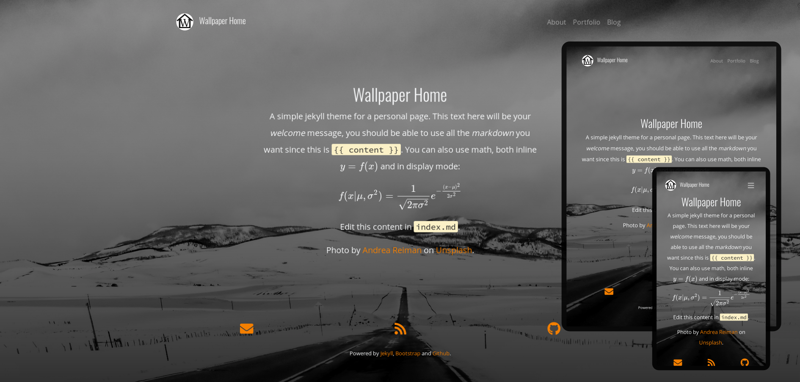

[](https://shields.io/)

# The Wallpaper Home Jekyll Theme

A simple theme for building a personal site with Jekyll. The home
page uses light text over a picture of your choice. The rest of the pages are
arranged within a light or a dark background. Besides the home page, the theme
includes a layout for a blog and a portfolio.
[Demo](https://rmvegasm.github.io/jekyll-theme-wallpaper-home).




## Installation

Add this line to your Jekyll site's `Gemfile`:

```ruby
gem "jekyll-theme-wallpaper-home"
```

And add this line to your Jekyll site's `_config.yml`:

```yaml
theme: jekyll-theme-wallpaper-home
```

And then execute:

    $ bundle

Or install it yourself as:

    $ gem install jekyll-theme-wallpaper-home

## Usage

### The `_config.yml` file

#### Site configuration

- `url:` the full address to your site.

- `baseurl:` the subpath where your site is hosted, if it differs from the root of the
  domain. Both of these values are used in filters to render appropriate link
  url's throughout the site. Check the [Jekyll
  docs](https://jekyllrb.com/docs/liquid/filters/) for more details.

- `title:` your site's title. This will be used to inform search engines, but also for
  the site's *brand* element in the navbar.

- `author:` the site's author. Will also be the default author for posts when there is no
  other value within the frontmatter.

- `logo:` the relative path to the site's logo.

- `background-img:` the relative path to the image to be used as wallpaper.

- `overlay-top:, overlay-bottom:` the wallpaper image is overlaid by a black,
  semi transparent layer to improve readability. These two values control the
  opacity at the top and bottom.

- `intro-width:` the width of the intro message displayed in the home page. You can adjust this
  to accomodate the length of your text.
  
- `link-color:` the color to use for links, in hexadecimal notation. Use it to select a color
  that plays well with your wallpaper image. This will be the color of every
  link in the page, including social icons in the footer.
  
- `dark:` boolean, if true the the site is rendered with light text over a dark
  background. This option also affects the syntax schema used, unless you
  provide one explicitly via the `syntax-theme:` option.
 
- `math:` boolean, set to `true` if you plan to use math. You can also set it in the
  frontmatter if you need math for only some pages rather than site--wide.

#### Google fonts

- `google-fonts:` optional, set your favorite google fonts. You can specify up to three
  different fonts for regular text, headings and code. Provide the string as
  expected by google fonts, as in `"Source+Code+Pro:300"`.

#### Footer links

- `social:` provide your username to get a social--media link in the footer, with the
  following exceptions:
  - `mail:` your full e--mail address
  - `rss:` boolean, if `true` generate rss feed
  - `linkedin`: provide the **full url**
  - `researchgate`: provide the **full url**
  - `stack_exchange`: provide the **full url**

#### Footer text

- `footer-text:` the text in the footer. HTML markup is needed here.

#### Build settings

Most of this section should not be touched, specially if your target is
github--pages. `syntax-theme:` allows you to use a costum syntax highlighting
scheme, see this [blog
post](https://rmvegasm.github.io/jekyll-theme-wallpaper-home/posts.html) for
details.

#### Pagination

Currently not working...

#### Portfolio

Don't touch.

### Layouts

- **default:** Includes the head and tail, content in between. This loads the stylesheets and
  scripts for other layouts.

- **home:** renders the content as centered text. Also includes the header with the navbar
  and the footer with social icons and footer--text.

- **page:** includes the header, and renders the page title and optional subtitle in a
  transparent container, overlaying the background image. Content and footer
  are rendered whithin a dark or a light box, depending on the value of
  `site.dark`.

- **post:** similar to the page layout, but title, optional subtitle, date and tags are used to
  build a frontmatter within the same box. Date can be omitted by including
  `no-date: true` in the yaml frontmatter.

- **blog:** uses the page layout, and lists the files in `_posts` as blog entries. The
  looping and structure of each entry is done by `_includes/blog.html`.

- **portfolio:** similar to the blog layout, but arranges the files in `_portfolio` as a grid.
  These files are expected to include an `img:` value within the frontmatter.
  Looping and structure is done by `_includes/portfolio.html`.

### Includes

- **head:** the `<head>` element, and the opening `<body>`.

- **header:** builds the navbar and the titlematter for page layouts.

- **resolve-dark:** this snippet searches for the value of `dark` within the
  site and page metadata, and assigns a variable `dark` accordingly. Is called
  by `_includes/footer.html`, `_includes/tags.html` and `_layouts/page.html`.

- **footer:** generates the icons and links for every value in `site.social`, appends the
  footer--text.

- **icons:** loops through `site.social` and if there is a value for any item, builds a
  link on the corresponding icon. Is called by `_includes/footer.html`.

- **tags:** loops through a page's tags and builds a *pill* for each of them. Is called by
  `_includes/blog.html` and `_includes/portfolio.html`.

- **blog:** loops through the files in `_posts/` and builds a bootstrap "jumbotron" for
  each one. Is called by `_layouts/blog.html`.

- **portfolio:** loops through the files in `_portfolio/` and builds a boostrap "card" for each
  one. Is called by `_layouts/portfolio.html`.

- **tail:** includes the bootstrap scripts and the closing `</body>` and `</html>` tags.

## Contributing

Bug reports and pull requests are welcome on GitHub at
[rmvegasm/jekyll-theme-wallpaper-home](https://github.com/rmvegasm/jekyll-theme-wallpaper-home).
This project is intended to be a safe, welcoming space for collaboration, and
contributors are expected to adhere to the [Contributor
Covenant](http://contributor-covenant.org) code of conduct.

## License

The theme is available as open source under the terms of the [MIT
License](https://opensource.org/licenses/MIT).

